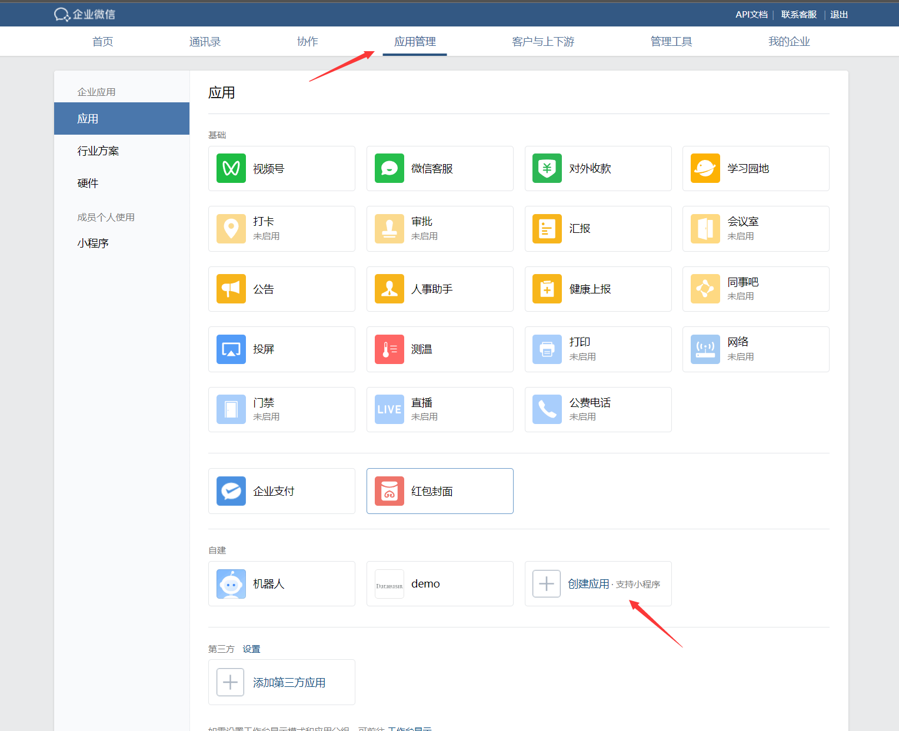
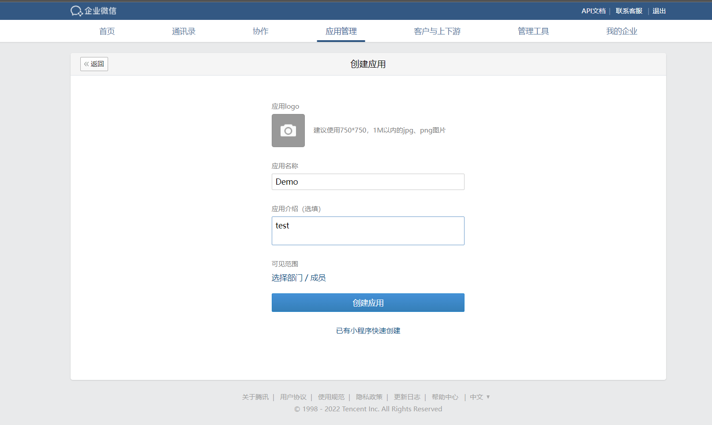
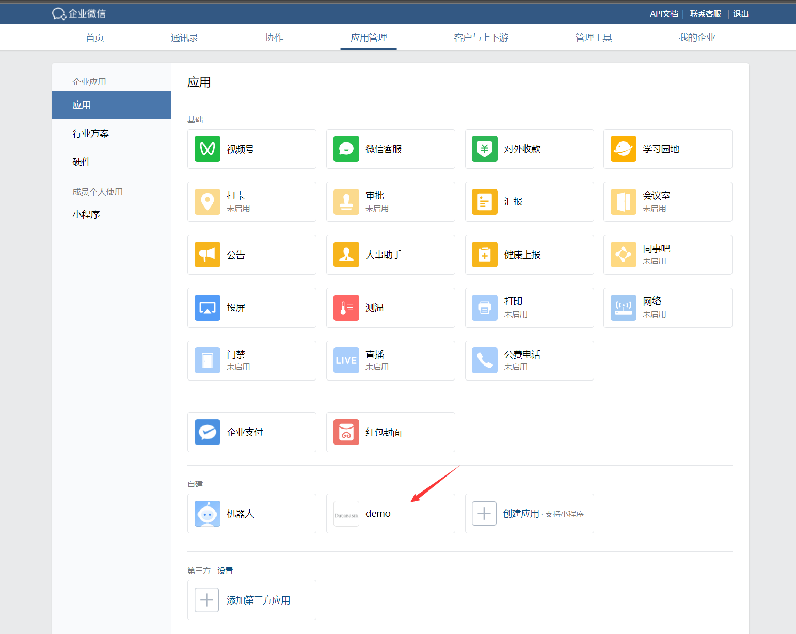
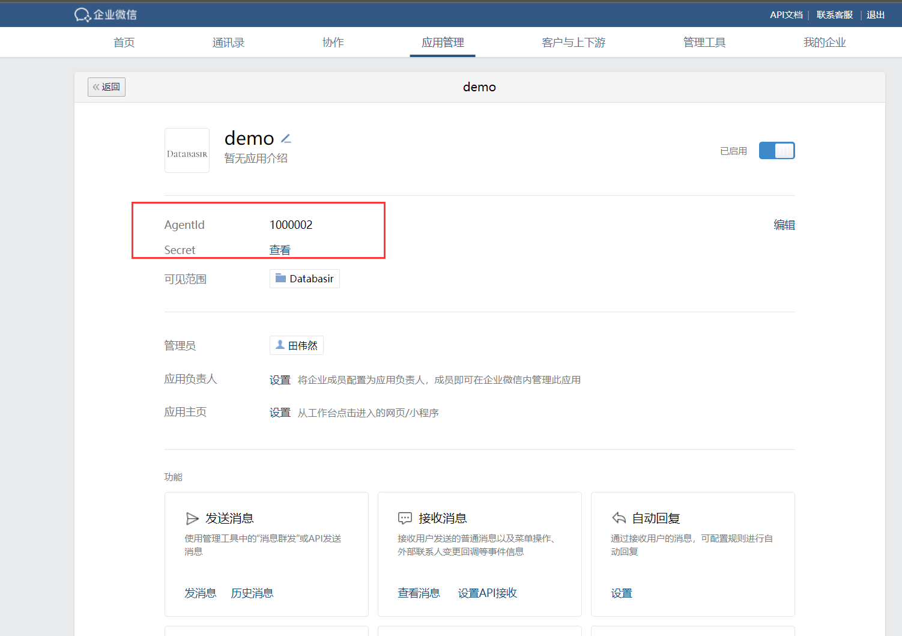
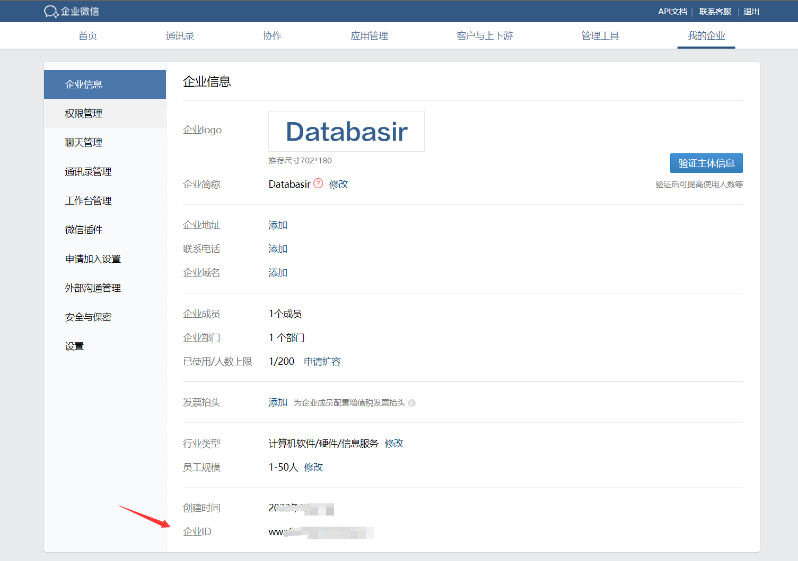
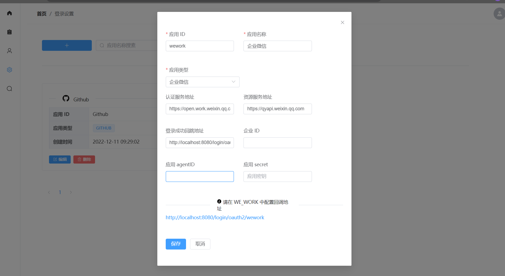

# 配置企业微信扫码登录

## 创建企业微信应用

- 填写你的应用名称和描述

## 获取 Secret 和 AgentId

- 查看 AgentId 和 Secret，保存下来后续需要使用

- 再进入 `我的企业` 获取企业 ID

## 配置 Databasir

- 在 `设置 -> 登录设置 -> 创建应用` 中配置前面获取到的企业ID、AgentId、Secret, 保存

